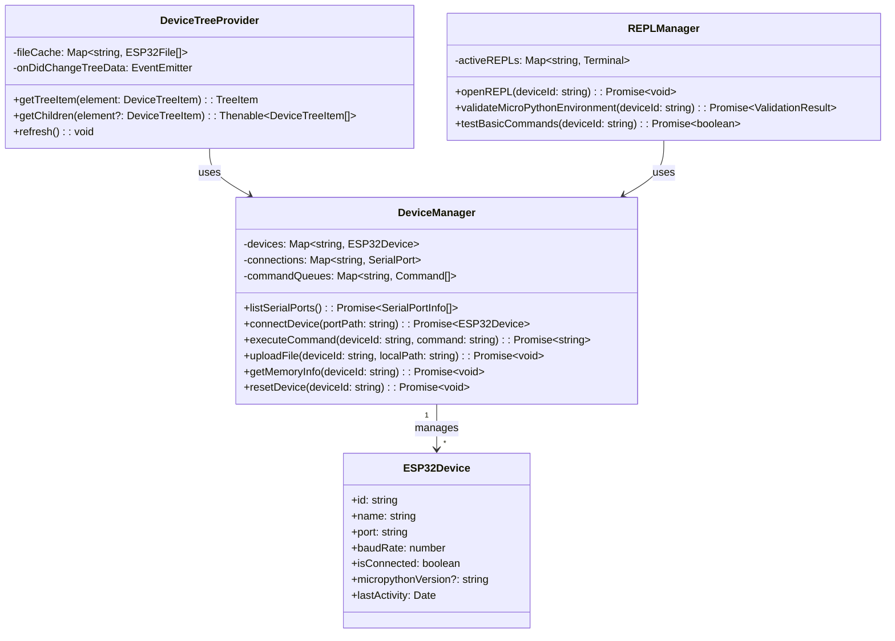
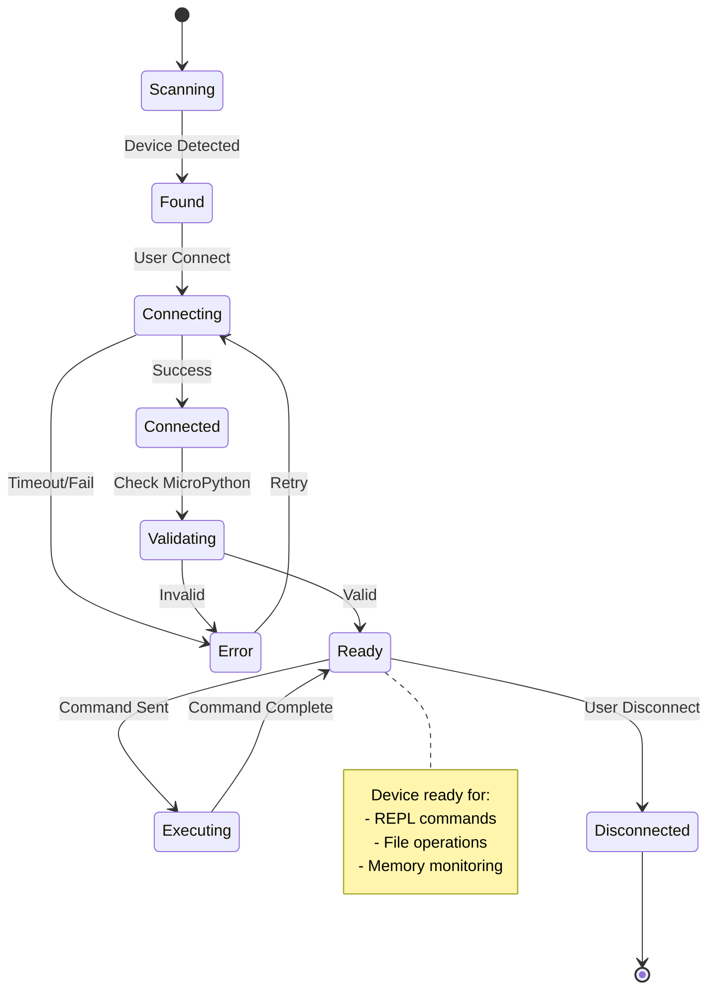
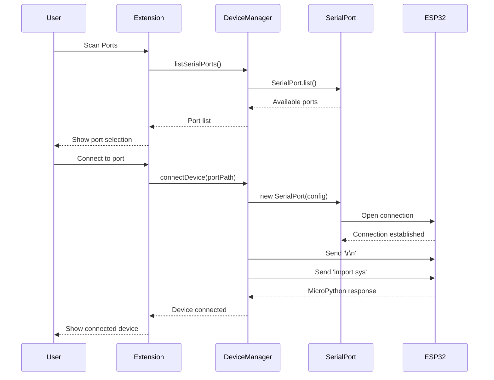
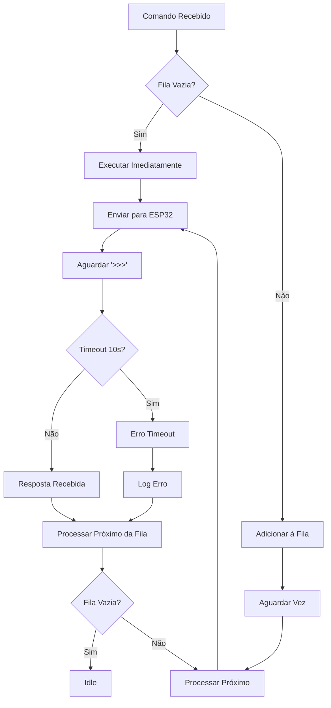
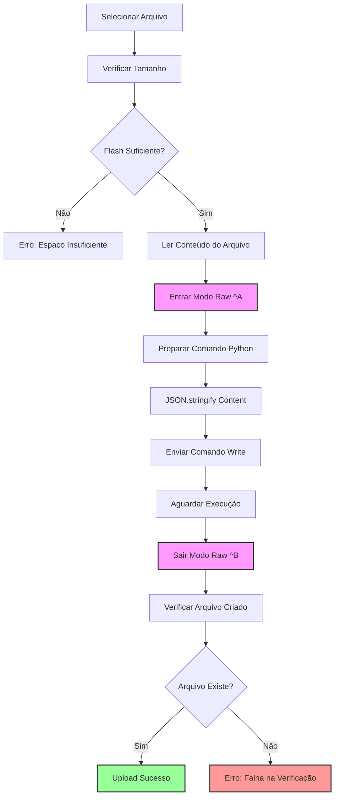
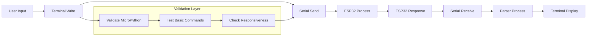
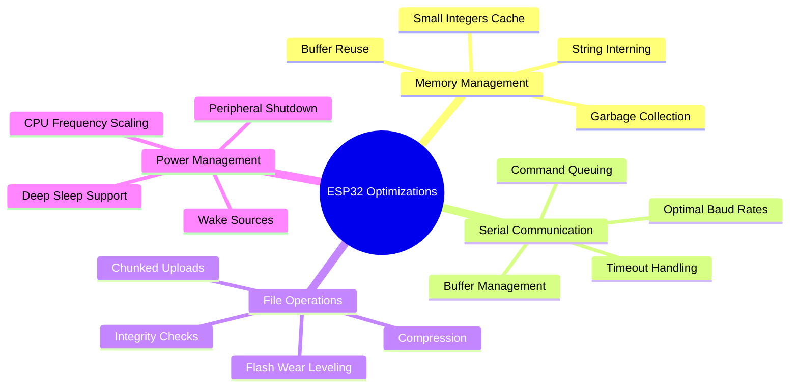
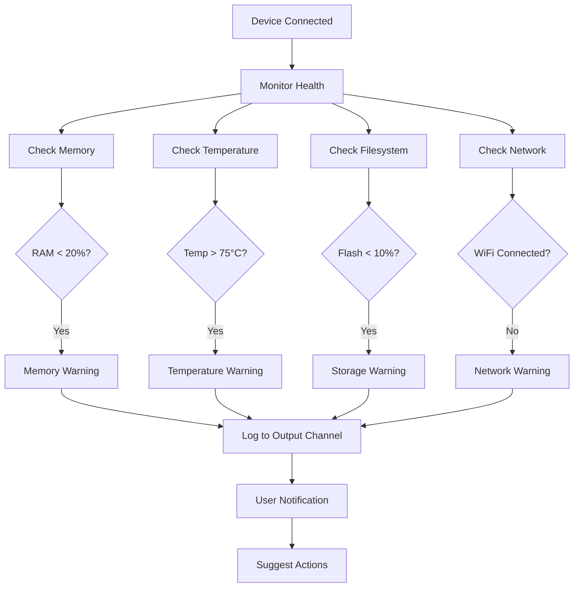
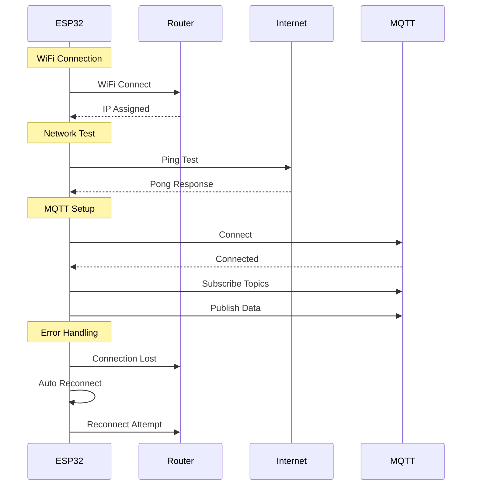

# 🔧 Diagramas Técnicos - MicroPython Manager

## 🏗️ Arquitetura de Classes



## 🔄 Fluxo de Estados dos Dispositivos



## 📊 Sequência de Conexão



## 🎯 Fila de Comandos (Otimização Critical)



## 🚀 Upload de Arquivo Otimizado



## 🖥️ REPL Terminal Flow



## 📁 File System Structure

```text
ESP32 File System (Flash)
├── /boot.py              (Auto-exec on boot)
├── /main.py              (Main application)
├── /lib/                 (Library modules)
│   ├── /wifi_manager.py
│   ├── /sensor_lib.py
│   └── /utils.py
├── /config/              (Configuration)
│   ├── /settings.json
│   └── /network.json
├── /data/                (Application data)
│   ├── /logs/
│   └── /cache/
└── /temp/                (Temporary files)

Memory Layout:
┌─────────────────────────────────────┐ 4MB Flash
│ MicroPython Firmware (~1MB)        │
├─────────────────────────────────────┤
│ File System (~3MB)                  │ ← User accessible
│ ├── User Scripts                    │
│ ├── Libraries                       │
│ └── Data Files                      │
└─────────────────────────────────────┘

RAM Layout (320KB):
┌─────────────────────────────────────┐
│ MicroPython Runtime (~100KB)       │
├─────────────────────────────────────┤
│ User Code & Variables (~220KB)     │ ← Available for code
│ ├── Imported Modules               │
│ ├── Variables & Objects            │
│ └── Execution Stack                │
└─────────────────────────────────────┘
```

## ⚡ Performance Optimizations



## 🔍 Debug & Monitoring



## 🌐 Network Operations (ESP32 Specific)



## 🔧 Extension Commands Mapping

```text
VS Code Command Palette
│
├── MicroPython: Scan Serial Ports
│   └── deviceManager.listSerialPorts()
│
├── MicroPython: Connect Device  
│   └── deviceManager.connectDevice(port)
│
├── MicroPython: Open REPL
│   └── replManager.openREPL(deviceId)
│
├── MicroPython: Upload File
│   └── deviceManager.uploadFile(deviceId, path)
│
├── MicroPython: Show Memory Info
│   └── deviceManager.getMemoryInfo(deviceId)
│
├── MicroPython: Reset Device
│   └── deviceManager.resetDevice(deviceId)
│
├── MicroPython: List Files
│   └── deviceManager.listFiles(deviceId)
│
└── MicroPython: Download File
    └── deviceManager.downloadFile(deviceId, remotePath)

Context Menu (Device Tree)
│
├── Right-click Device
│   ├── Open REPL
│   ├── Upload File
│   ├── Reset Device
│   ├── Memory Info
│   └── Disconnect
│
└── Right-click File
    ├── Download
    ├── Delete
    └── View Content
```

---

**Nota Técnica:** Todos os diagramas foram otimizados considerando as limitações específicas do ESP32:
- **RAM limitada** (320KB): Uso eficiente de buffers
- **Flash limitado** (4MB): Gestão inteligente de arquivos  
- **CPU dual-core** (240MHz): Processamento paralelo quando possível
- **Comunicação serial**: Baudrates otimizados e timeouts adequados
- **Temperatura operacional**: Monitoramento para evitar throttling
