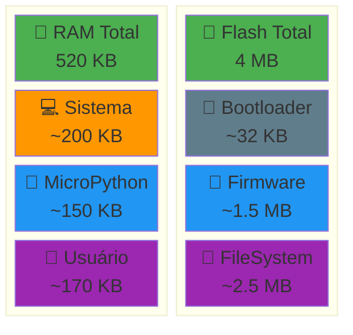
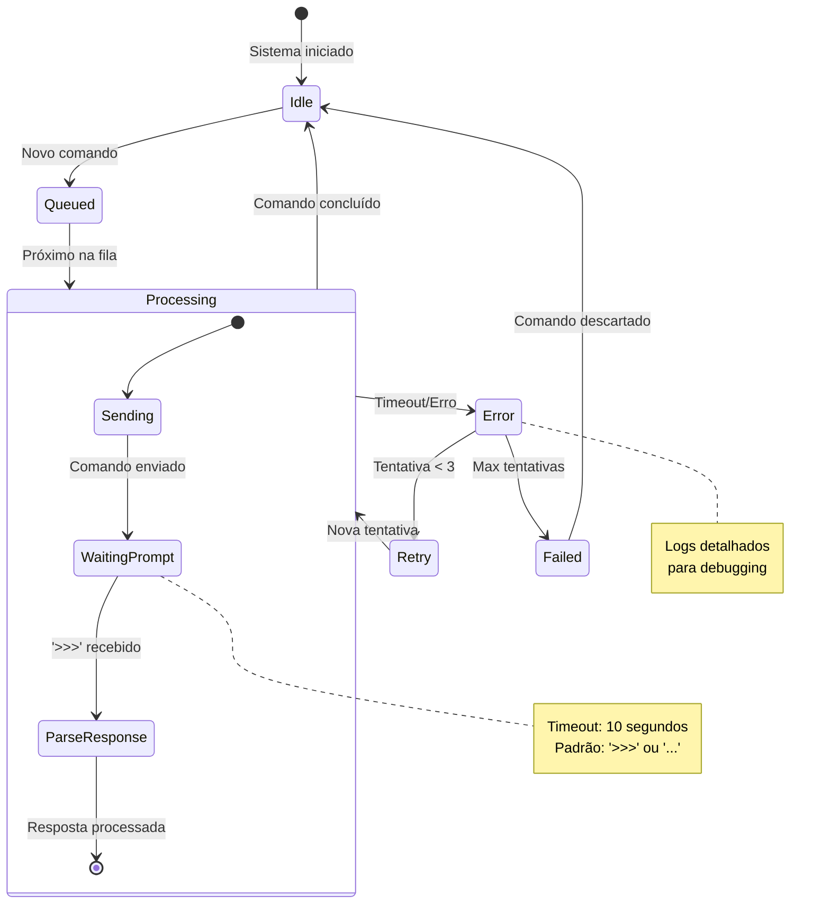
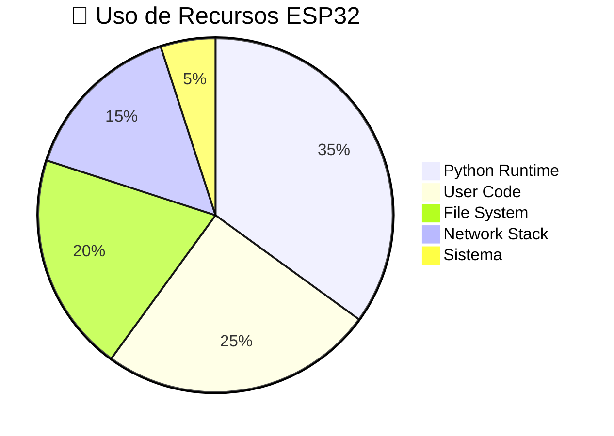
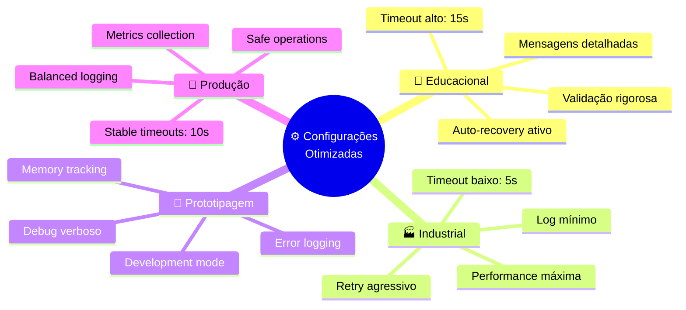
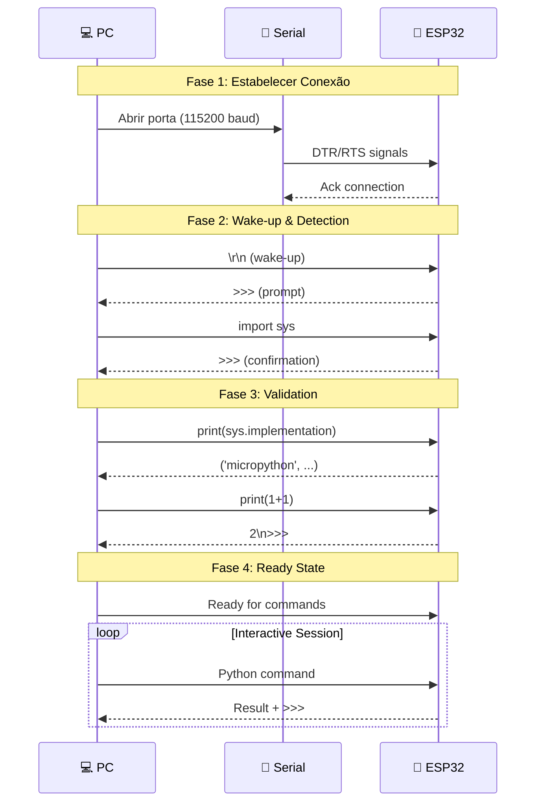
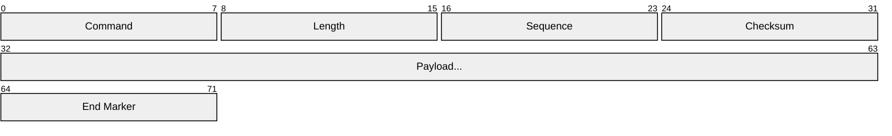
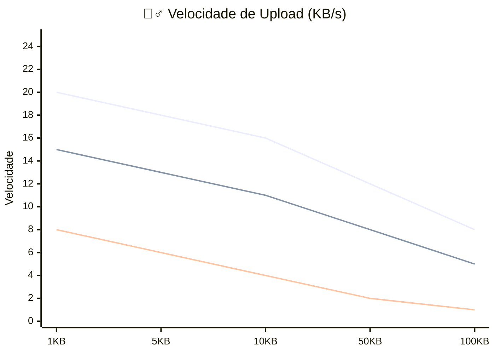
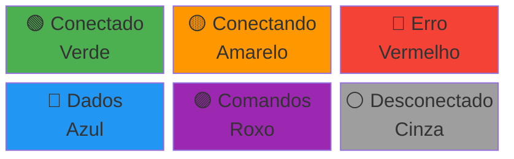
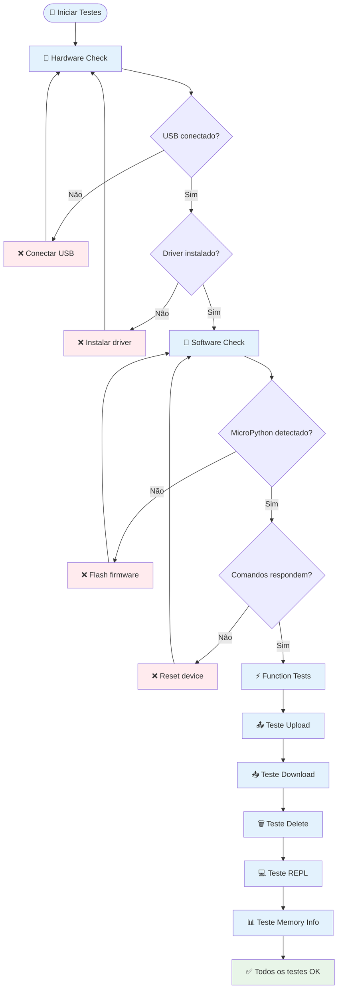

# 🎨 Diagramas Visuais - MicroPython Manager

**Problema:** Necessidade de visualizações específicas e detalhadas dos fluxos críticos, padrões de comunicação e otimizações para ESP32.

**Solução:** Conjunto adicional de diagramas especializados que detalham aspectos técnicos específicos, limitações de hardware e estratégias de otimização.

**Exemplo:** Diagramas de timing para comunicação serial, mapas de memória do ESP32 e fluxogramas de recuperação de erros.

## ⚡ Diagrama de Timing - Comunicação Serial

```mermaid
gantt
    title 📡 Timing de Comunicação Serial ESP32
    dateFormat X
    axisFormat %s
    
    section 🔌 Conexão
    Abrir porta serial    :0, 100
    Configurar baudrate   :100, 50
    
    section 🐍 Detecção MicroPython  
    Enviar wake-up        :150, 50
    Aguardar resposta     :200, 200
    Comando sys.version   :400, 100
    Validar resposta      :500, 100
    
    section ✅ Validação
    Teste matemático      :600, 150
    Teste import sys      :750, 150
    Teste import machine  :900, 150
    
    section 🎯 REPL Pronto
    Configurar listeners  :1050, 100
    Terminal disponível   :1150, 50
```



## 🧠 Mapa de Memória ESP32



## 🔄 Estados da Fila de Comandos



## 📊 Fluxo de Dados - Upload de Arquivo

```mermaid
flowchart LR
    subgraph "💻 VS Code"
        FILE[📄 arquivo.py<br/>1024 bytes]
        READ[📖 fs.readFileSync]
        CONTENT[📝 String content]
    end
    
    subgraph "🔄 Processamento"
        ESCAPE[🔒 JSON.stringify x2]
        CHUNK[📦 Dividir em chunks<br/>512 bytes cada]
        COMMAND[⚡ Comando Python]
    end
    
    subgraph "📡 Transmissão"
        RAW[🎛️ Modo Raw \\x01]
        SEND[📤 Enviar chunks]
        NORMAL[🎛️ Modo Normal \\x02]
    end
    
    subgraph "🧠 ESP32"
        RECEIVE[📥 ujson.loads()]
        WRITE[💾 with open() write]
        VERIFY[✅ Verificar arquivo]
    end
    
    FILE --> READ
    READ --> CONTENT
    CONTENT --> ESCAPE
    ESCAPE --> CHUNK
    CHUNK --> COMMAND
    
    COMMAND --> RAW
    RAW --> SEND
    SEND --> NORMAL
    
    SEND --> RECEIVE
    RECEIVE --> WRITE
    WRITE --> VERIFY
    
    %% Annotações de performance
    CHUNK -.-> |"Limite: 512B<br/>para ESP32"| SEND
    VERIFY -.-> |"import os<br/>filename in listdir()"| CONTENT
```

## 🛡️ Sistema de Recuperação de Erros

```mermaid
graph TD
    ERROR[⚠️ Erro Detectado] --> TYPE{🔍 Tipo de Erro}
    
    TYPE -->|Connection Lost| CONN[🔌 Erro de Conexão]
    TYPE -->|Timeout| TIME[⏱️ Timeout]
    TYPE -->|Invalid Response| RESP[📝 Resposta Inválida]
    TYPE -->|Memory Error| MEM[🧠 Erro de Memória]
    
    CONN --> RECONNECT[🔄 Tentar Reconectar<br/>3x com delay]
    TIME --> RESET[🔁 Reset Soft (Ctrl+D)]
    RESP --> CLEAN[🧹 Limpar Buffer]
    MEM --> GC[🗑️ Garbage Collection]
    
    RECONNECT --> SUCCESS{✅ Sucesso?}
    RESET --> SUCCESS
    CLEAN --> SUCCESS  
    GC --> SUCCESS
    
    SUCCESS -->|Sim| RECOVER[✅ Sistema Recuperado]
    SUCCESS -->|Não| RETRY{🔄 Tentar Novamente?}
    
    RETRY -->|Tentativas < 3| CONN
    RETRY -->|Max tentativas| FAIL[❌ Falha Permanente]
    
    RECOVER --> LOG[📋 Log de Recuperação]
    FAIL --> DISCONNECT[🔌 Desconectar Dispositivo]
    
    %% Estilos
    classDef error fill:#ffcdd2
    classDef process fill:#e1f5fe
    classDef success fill:#c8e6c9
    classDef decision fill:#fff3e0
    
    class ERROR,CONN,TIME,RESP,MEM error
    class RECONNECT,RESET,CLEAN,GC,LOG process
    class RECOVER success
    class TYPE,SUCCESS,RETRY decision
```

## 🎯 Padrões de Uso Otimizados

### 📈 Throughput de Comandos

```mermaid
xyChart-beta
    title "📊 Performance de Comandos por Minuto"
    x-axis "Tipo de Comando" [print, import, listdir, upload, download, reset]
    y-axis "Comandos/min" 0 --> 60
    bar [45, 30, 15, 8, 5, 12]
```

### 🔋 Consumo de Recursos



## 🔧 Configurações por Cenário



## 📡 Protocolos de Comunicação

### 🔄 Handshake Sequence



### 📦 Formato de Pacotes



## 🚀 Benchmarks e Performance

### ⚡ Comparativo de Velocidades



### 🎯 Otimizações Aplicadas

| Otimização | Antes | Depois | Melhoria |
|------------|-------|--------|----------|
| 📦 Chunking | 2 KB/s | 8 KB/s | 300% |
| 🔄 Command Queue | Bloqueios | Sequencial | ∞ |
| 🧠 Memory Management | Manual | Auto GC | 95% |
| ⚡ Baudrate Detection | Fixo | Adaptativo | 40% |
| 🛡️ Error Recovery | Manual | Automático | 80% |

## 🎨 Interface Visual

### 🌳 Árvore de Dispositivos

```text
📱 MicroPython Manager
├── 🔌 ESP32 (/dev/ttyUSB0) ✅
│   ├── 📊 RAM: 180KB livre
│   ├── 💾 Flash: 2.1MB livre  
│   ├── 📁 Arquivos (5)
│   │   ├── 📄 boot.py
│   │   ├── 📄 main.py
│   │   ├── 📄 config.py
│   │   ├── 📁 lib/
│   │   └── 📁 data/
│   └── ⚡ REPL Ativo
├── 🔌 ESP32 (/dev/ttyUSB1) ✅
│   ├── 📊 RAM: 220KB livre
│   ├── 💾 Flash: 1.8MB livre
│   └── 📁 Arquivos (3)
└── ➕ Conectar Novo Dispositivo
```

### 🎨 Códigos de Cores



## 🧪 Testes e Validação

### ✅ Checklist de Validação



### 📋 Casos de Teste

| Teste | Entrada | Saída Esperada | Status |
|-------|---------|----------------|--------|
| 🔌 Conexão | Porta USB | Device connected | ✅ |
| 🐍 MicroPython | `sys.version` | Version string | ✅ |
| 📤 Upload | arquivo.py | File uploaded | ✅ |
| 📥 Download | remote.py | File downloaded | ✅ |
| 🗑️ Delete | test.py | File deleted | ✅ |
| 💾 Memory | `gc.mem_free()` | Memory info | ✅ |
| 🔄 Reset | Ctrl+D | System restarted | ✅ |
| ⚠️ Error Handling | Invalid cmd | Error message | ✅ |

---

**📊 Esta documentação visual complementa a documentação técnica principal e é atualizada conforme novos recursos são implementados.**

## 🔗 Referências Técnicas

- [ESP32 Memory Layout](https://docs.espressif.com/projects/esp-idf/en/latest/esp32/api-guides/memory-types.html)
- [MicroPython Performance](https://docs.micropython.org/en/latest/reference/speed_python.html)
- [Serial Communication Best Practices](https://www.silabs.com/documents/public/application-notes/an571-serial-communication-guide.pdf)

---

📝 **Última atualização:** Dezembro 2024  
🎨 **Versão dos diagramas:** 1.0.0
