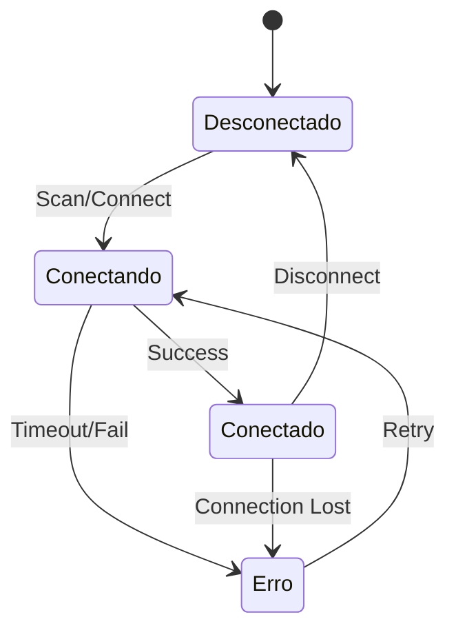

# 📱 MicroPython Manager - Documentação Técnica

## 🎯 Visão Geral do Projeto

O **MicroPython Manager** é uma extensão do VS Code otimizada para desenvolvimento em ESP32, focando em eficiência de memória RAM/Flash e gerenciamento inteligente de recursos limitados.

### 🏗️ Arquitetura Geral

```
┌─────────────────────────────────────────────────────────────────┐
│                      VS CODE EXTENSION                         │
├─────────────────────────────────────────────────────────────────┤
│  ┌─────────────┐  ┌─────────────┐  ┌─────────────┐  ┌─────────┐ │
│  │ Extension   │  │ DeviceTree  │  │ REPL        │  │ File    │ │
│  │ Manager     │  │ Provider    │  │ Manager     │  │ Manager │ │
│  └─────────────┘  └─────────────┘  └─────────────┘  └─────────┘ │
├─────────────────────────────────────────────────────────────────┤
│                   DEVICE MANAGER (Core)                        │
│  ┌─────────────┐  ┌─────────────┐  ┌─────────────┐             │
│  │ Serial      │  │ Command     │  │ Memory      │             │
│  │ Connection  │  │ Queue       │  │ Monitor     │             │
│  └─────────────┘  └─────────────┘  └─────────────┘             │
├─────────────────────────────────────────────────────────────────┤
│                     HARDWARE LAYER                             │
│  ┌─────────────┐  ┌─────────────┐  ┌─────────────┐             │
│  │ ESP32 #1    │  │ ESP32 #2    │  │ ESP32 #N    │             │
│  │ UART/USB    │  │ UART/USB    │  │ UART/USB    │             │
│  └─────────────┘  └─────────────┘  └─────────────┘             │
└─────────────────────────────────────────────────────────────────┘
```

## 🔧 Componentes Principais

### 1. DeviceManager (Core Engine)

**Problema:** ESP32 tem limitações de memória RAM (320KB) e comunicação serial instável.
**Solução:** Gerenciador centralizado com fila de comandos e otimização de recursos.

```typescript
// Gerenciamento otimizado para ESP32
class DeviceManager {
    private devices: Map<string, ESP32Device>           // Estado dos dispositivos
    private connections: Map<string, SerialPort>        // Conexões ativas
    private commandQueues: Map<string, Command[]>       // Fila por dispositivo
    private outputChannels: Map<string, OutputChannel>  // Canais de saída
}
```

#### 🔄 Fluxograma de Conexão

```
┌─────────────────┐
│ Escanear Portas │
└─────────┬───────┘
          │
          ▼
┌─────────────────┐     ┌──────────────────┐
│ Detectar ESP32  │────▶│ Tentar 115200    │
└─────────┬───────┘     │ baud rate        │
          │             └─────────┬────────┘
          │                       │
          ▼                       ▼
┌─────────────────┐     ┌──────────────────┐
│ Validar         │     │ Falhou?          │
│ MicroPython     │◀────│ Tentar 9600 baud │
└─────────┬───────┘     └──────────────────┘
          │
          ▼
┌─────────────────┐
│ Conexão         │
│ Estabelecida    │
└─────────────────┘
```

#### 🎛️ Sistema de Fila de Comandos

**Problema:** ESP32 não suporta comandos simultâneos via REPL.
**Solução:** Fila sequencial com timeout otimizado.

```
Comando 1 ──┐
Comando 2 ──┤
Comando 3 ──┤──▶ [FILA] ──▶ ESP32 ──▶ Aguarda ">>>" ──▶ Próximo
Comando N ──┘                │                          │
                              ▼                          │
                        [Timeout 10s]                    │
                              │                          │
                              ▼                          │
                         [Erro/Retry] ◀──────────────────┘
```

### 2. TreeDataProvider (Interface Visual)

**Problema:** Visualização eficiente de múltiplos dispositivos ESP32.
**Solução:** Árvore hierárquica com cache inteligente.

```
🔌 ESP32 Devices
├── 📱 ESP32 (/dev/ttyUSB0) ✅ Conectado
│   ├── 📄 main.py (1.2KB)
│   ├── 📄 boot.py (0.8KB)
│   ├── 📁 lib/
│   │   ├── 📄 sensor.py (2.1KB)
│   │   └── 📄 wifi_manager.py (3.4KB)
│   └── 📁 config/
├── 📱 ESP32 (/dev/ttyUSB1) ❌ Desconectado
└── 📱 ESP32 (/dev/ttyACM0) ⚠️ Erro
```

#### 🗂️ Estados dos Dispositivos



### 3. REPLManager (Terminal Interativo)

**Problema:** ESP32 precisa de terminal responsivo para debug em tempo real.
**Solução:** Terminal customizado com validação MicroPython.

#### 🖥️ Fluxo do REPL

```
┌─────────────────┐
│ Abrir REPL      │
└─────────┬───────┘
          │
          ▼
┌─────────────────┐
│ Validar         │
│ MicroPython     │
└─────────┬───────┘
          │
          ▼
┌─────────────────┐     ┌──────────────────┐
│ Testar Comandos │────▶│ import sys       │
│ Básicos         │     │ print(sys.ver)   │
└─────────┬───────┘     └──────────────────┘
          │
          ▼
┌─────────────────┐
│ Terminal        │
│ Interativo      │
│ Pronto          │
└─────────────────┘
```

### 4. FileManager (Gestão de Arquivos)

**Problema:** ESP32 tem Flash limitado (4MB típico), necessita gestão eficiente.
**Solução:** Upload/download otimizado com verificação de integridade.

#### 📁 Fluxo de Upload

```
┌─────────────────┐
│ Selecionar      │
│ Arquivo Local   │
└─────────┬───────┘
          │
          ▼
┌─────────────────┐     ┌──────────────────┐
│ Validar Tamanho │────▶│ Flash livre?     │
│ vs Flash ESP32  │     │ > tamanho?       │
└─────────┬───────┘     └─────────┬────────┘
          │                       │ Não
          │ Sim                   ▼
          ▼               ┌──────────────────┐
┌─────────────────┐       │ Erro: Espaço     │
│ Modo Raw (^A)   │       │ Insuficiente     │
└─────────┬───────┘       └──────────────────┘
          │
          ▼
┌─────────────────┐
│ Transferir      │
│ com JSON        │
│ encoding        │
└─────────┬───────┘
          │
          ▼
┌─────────────────┐
│ Sair Raw (^B)   │
└─────────┬───────┘
          │
          ▼
┌─────────────────┐
│ Verificar       │
│ Integridade     │
└─────────────────┘
```

## 🚀 Comandos e Funcionalidades

### 📊 Mapa de Comandos

```
Extension Commands
├── 🔍 micropython-manager.scanPorts
│   └── Lista portas seriais disponíveis
├── 🔌 micropython-manager.connectDevice  
│   └── Conecta a dispositivo ESP32
├── ❌ micropython-manager.disconnectDevice
│   └── Desconecta dispositivo específico
├── 🔄 micropython-manager.resetDevice
│   └── Soft reset (Ctrl+D) via fila
├── 🖥️ micropython-manager.openREPL
│   └── Terminal interativo MicroPython
├── 📤 micropython-manager.uploadFile
│   └── Upload otimizado para ESP32
├── 📥 micropython-manager.downloadFile  
│   └── Download com verificação
├── 📋 micropython-manager.listFiles
│   └── Lista arquivos do filesystem
├── 💾 micropython-manager.showMemoryInfo
│   └── RAM/Flash usage em tempo real
└── 🗑️ micropython-manager.deleteFile
    └── Remove arquivos do ESP32
```

### 🔧 Otimizações para ESP32

#### 💡 Gestão de Memória

**Problema:** ESP32 com RAM limitada (320KB) precisa de monitoramento constante.
**Solução:** Comando otimizado que coleta garbage antes da análise.

```python
# Comando executado no ESP32
import gc
gc.collect()  # Libera memória antes da medição
free = gc.mem_free()
alloc = gc.mem_alloc() 
total = free + alloc
print(f"RAM Livre: {free/1024:.1f}KB ({free/total*100:.1f}%)")
```

#### ⚡ Otimizações de Performance

```
Baudrate Priority:
1. 115200 baud (padrão ESP32)
2. 9600 baud   (fallback)
3. 57600 baud  (compatibilidade)

Timeout Strategy:
- Comando normal: 10s
- Upload arquivo: 30s  
- Reset device: 5s
- Memory info: 15s

Buffer Management:
- Chunk size: 1KB para uploads
- Queue limit: 10 comandos por device
- Cache TTL: 30s para file list
```

## 🔌 Configuração de Conexão Serial

### ⚙️ Parâmetros Otimizados

```typescript
const serialConfig = {
    baudRate: 115200,    // Otimizado para ESP32
    dataBits: 8,         // Padrão MicroPython
    stopBits: 1,         // Mínimo necessário
    parity: 'none',      // Sem paridade (+ velocidade)
    autoOpen: false,     // Controle manual
    highWaterMark: 1024  // Buffer otimizado
}
```

### 🔄 Detecção MicroPython

```
┌─────────────────┐
│ Conectar Serial │
└─────────┬───────┘
          │
          ▼
┌─────────────────┐
│ Enviar '\r\n'   │  ← Wake up
└─────────┬───────┘
          │
          ▼
┌─────────────────┐
│ Enviar          │
│ 'import sys'    │
└─────────┬───────┘
          │
          ▼
┌─────────────────┐
│ Aguardar        │  ← Timeout 3s
│ 'MicroPython'   │
└─────────┬───────┘
          │
          ▼
┌─────────────────┐
│ Extrair versão  │  ← Regex pattern
│ se disponível   │
└─────────────────┘
```

## 📈 Monitoramento e Debug

### 🎯 Output Channels

Cada ESP32 conectado possui seu próprio canal de saída:

```
Output Channels:
├── 📺 ESP32 - /dev/ttyUSB0
├── 📺 ESP32 - /dev/ttyUSB1  
└── 📺 ESP32 - /dev/ttyACM0
```

### 🔍 Debug Information

```python
# Informações coletadas automaticamente
System Info:
├── MicroPython Version: 1.20.0
├── ESP32 Chip: ESP32-D0WDQ6
├── RAM Total: 320KB
├── RAM Livre: 245KB (76.5%)
├── Flash Total: 4MB
├── Flash Livre: 3.2MB (80%)
├── CPU Freq: 240MHz
└── Temperatura: 45.2°C
```

## 🛠️ Instalação e Configuração

### 📦 Dependências

```json
{
  "dependencies": {
    "serialport": "^12.0.0"  // Comunicação serial otimizada
  },
  "devDependencies": {
    "@types/serialport": "^8.0.5",
    "typescript": "^5.8.3"
  }
}
```

### 🚀 Quick Start

1. **Instalar extensão** no VS Code
2. **Conectar ESP32** via USB
3. **Abrir Command Palette** (`Ctrl+Shift+P`)
4. **Executar:** `MicroPython: Escanear Portas Seriais`
5. **Selecionar** porta do ESP32
6. **Aguardar** detecção automática
7. **Usar** REPL, upload files, etc.

## 🎨 Interface Visual

### 🌳 Árvore de Dispositivos

```
🔌 Dispositivos MicroPython
├── 📱 ESP32 (/dev/ttyUSB0) ✅
│   ├── 📄 main.py (1.2KB)
│   ├── 📄 boot.py (0.8KB)
│   ├── 📁 lib/
│   │   ├── 📄 wifi_manager.py (3.4KB)
│   │   └── 📄 sensor_driver.py (2.1KB)
│   └── 📁 data/
│       └── 📄 config.json (0.3KB)
└── 📱 ESP32 (/dev/ttyUSB1) ❌
```

### 🎛️ Context Menu

```
Right-click no dispositivo:
├── 🖥️ Abrir REPL
├── 📤 Upload Arquivo
├── 🔄 Reset Device
├── 💾 Info Memória
├── 📋 Listar Arquivos
└── ❌ Desconectar

Right-click no arquivo:
├── 📥 Download
├── ✏️ Editar
└── 🗑️ Excluir
```

## 🚧 Limitações e Considerações

### ⚠️ Limitações ESP32

```
Hardware Constraints:
├── RAM: 320KB (limite crítico)
├── Flash: 4MB típico
├── CPU: 240MHz dual-core
├── Serial: 1 UART principal
└── Temp: Operação até 85°C

Software Constraints:
├── MicroPython stack: ~100KB
├── User code space: ~220KB RAM
├── File system: ~3.5MB Flash
├── Concurrent ops: Limitado
└── Real-time: Soft real-time
```

### 🔧 Troubleshooting

```
Problemas Comuns:
├── Porta ocupada: Verificar outros softwares
├── Baudrate: Tentar 9600 se 115200 falhar
├── Driver: Instalar driver CH340/CP210x
├── Permissão: sudo usermod -a -G dialout $USER
└── Reset: Pressionar EN button no ESP32
```

## 📝 Contribuindo

### 🎯 Padrões de Código

- **Comentários:** Formato Problema + Solução + Exemplo
- **Otimização:** Priorizar eficiência para ESP32
- **Error Handling:** Timeout e retry para serial
- **Memory:** Evitar alocação desnecessária
- **Testing:** Testar com múltiplos ESP32


## 📚 Referências Técnicas

- [ESP32 Datasheet](https://www.espressif.com/sites/default/files/documentation/esp32_datasheet_en.pdf)
- [MicroPython ESP32 Guide](https://docs.micropython.org/en/latest/esp32/quickref.html)
- [VS Code Extension API](https://code.visualstudio.com/api)
- [SerialPort Node.js](https://serialport.io/docs/)

**Versão:** 0.0.1  
**Última atualização:** 26 de Junho, 2025  
**Autor:** MicroPython Manager Team
