# 📚 Documentação Técnica - MicroPython Manager

**Problema:** Desenvolvedores ESP32 precisam de documentação visual completa para entender o fluxo de funcionamento, arquitetura e interações entre componentes do MicroPython Manager.

**Solução:** Documentação abrangente com fluxogramas detalhados, diagramas de arquitetura e ilustrações visuais que facilitem o entendimento do sistema, seguindo as limitações de hardware e software do ESP32.

**Exemplo:** Diagrama completo mostrando desde a descoberta de dispositivos até execução de comandos REPL, incluindo gestão de memória e otimizações específicas para ESP32.

## 🏗️ Arquitetura Geral

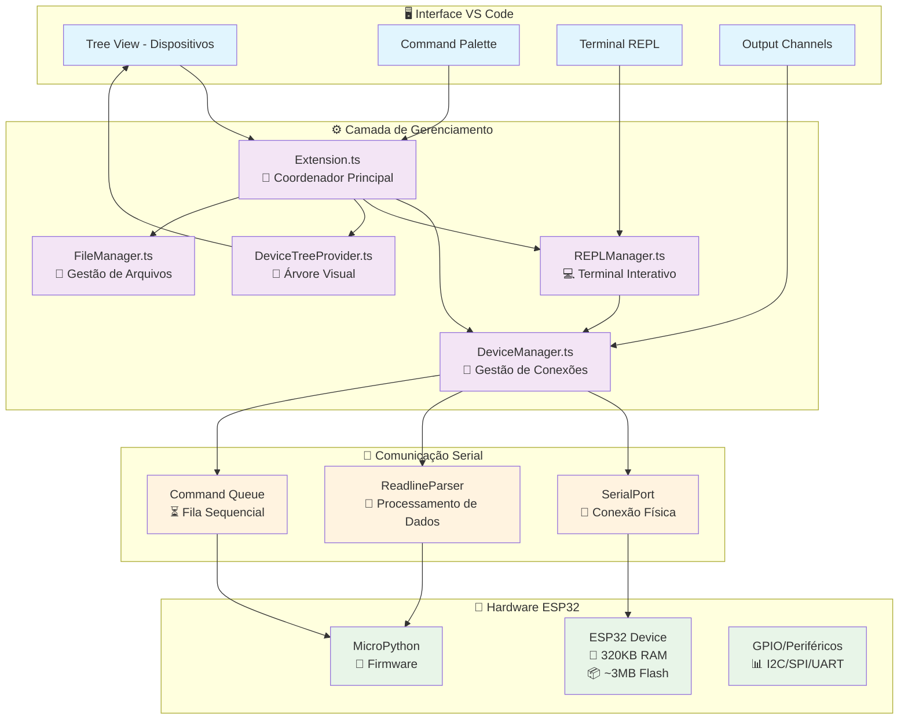

## 🔄 Fluxo Principal de Funcionamento

### 1. 🔍 Descoberta e Conexão de Dispositivos

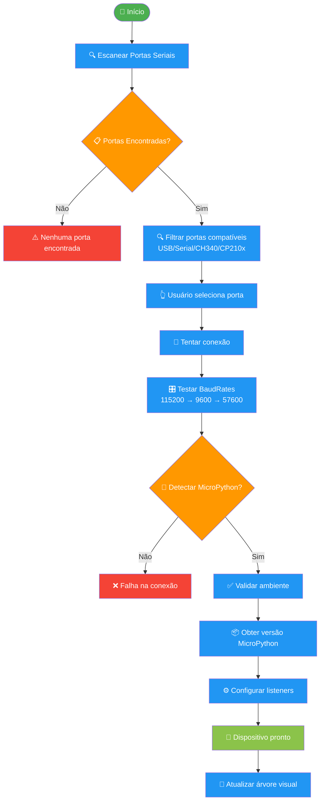

### 2. 💻 Fluxo do REPL Interativo

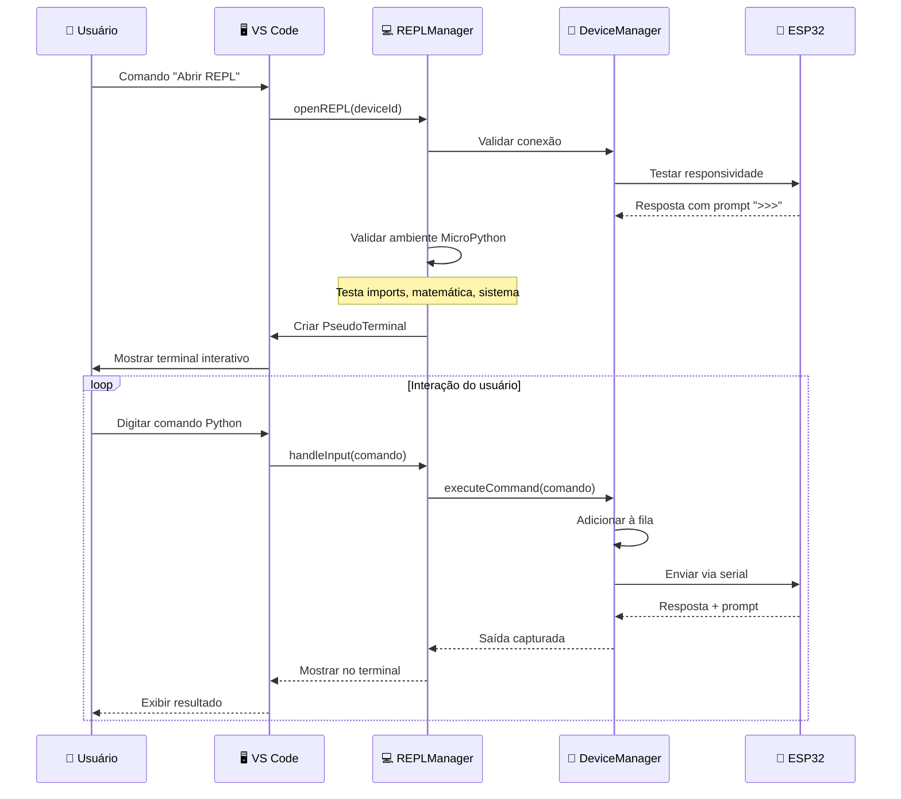

### 3. 📁 Gestão de Arquivos

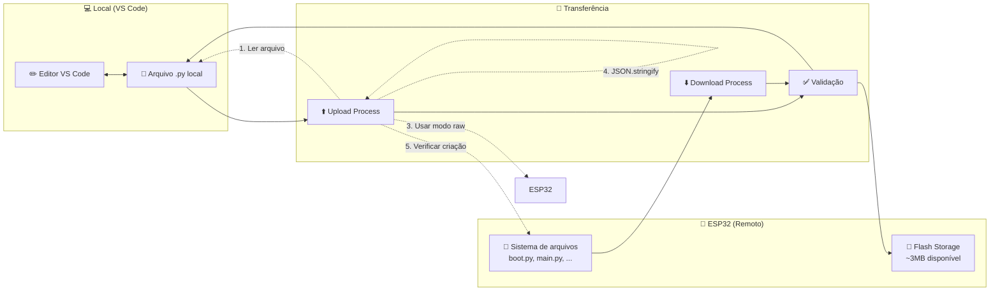

## 🔧 Componentes Detalhados

### DeviceManager.ts - 🔌 Gerenciador Central

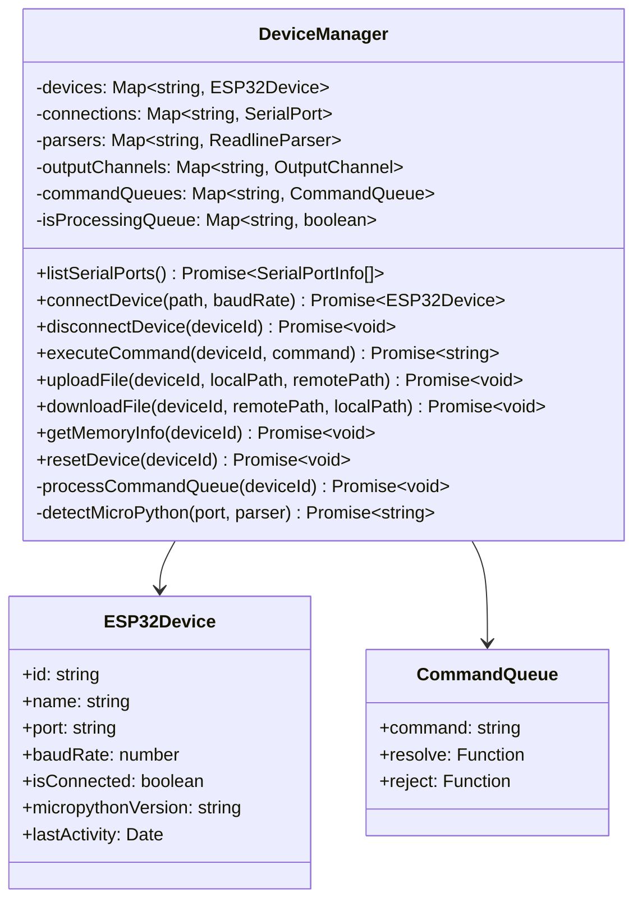

### REPLManager.ts - 💻 Terminal Interativo

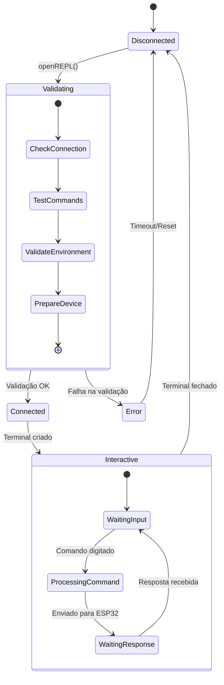

### 📊 Fila de Comandos (Command Queue)

```mermaid
graph LR
    subgraph "🎯 Entrada de Comandos"
        USER[👤 Usuário REPL]
        API[🔧 API Calls]
        UPLOAD[📤 Upload Files]
    end
    
    subgraph "⏳ Fila Sequencial"
        Q1[Comando 1<br/>print('hello')]
        Q2[Comando 2<br/>import os]
        Q3[Comando 3<br/>os.listdir()]
        Q4[Comando 4<br/>gc.collect()]
    end
    
    subgraph "🔄 Processamento"
        PROC[🎛️ Processador<br/>Um comando por vez]
        WAIT[⏱️ Aguardar '>>>' prompt]
    end
    
    subgraph "🧠 ESP32"
        EXEC[⚡ Execução]
        RESP[📤 Resposta + '>>>']
    end
    
    USER --> Q1
    API --> Q2
    UPLOAD --> Q3
    
    Q1 --> PROC
    Q2 --> |Aguarda| Q1
    Q3 --> |Aguarda| Q2
    Q4 --> |Aguarda| Q3
    
    PROC --> EXEC
    EXEC --> RESP
    RESP --> WAIT
    WAIT --> |Próximo| PROC
    
    %% Estilos
    classDef input fill:#e3f2fd
    classDef queue fill:#fff3e0
    classDef process fill:#f3e5f5
    classDef esp32 fill:#e8f5e8
    
    class USER,API,UPLOAD input
    class Q1,Q2,Q3,Q4 queue
    class PROC,WAIT process
    class EXEC,RESP esp32
```

## 🔧 Limitações de Hardware ESP32

### 💾 Gestão de Memória

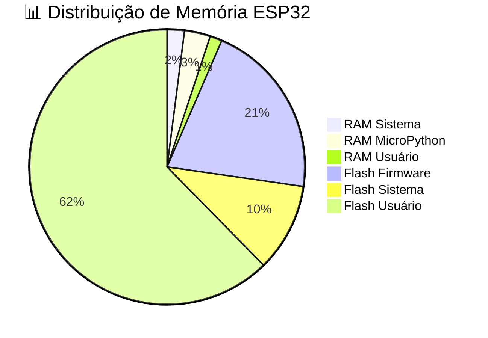

### ⚡ Otimizações Implementadas

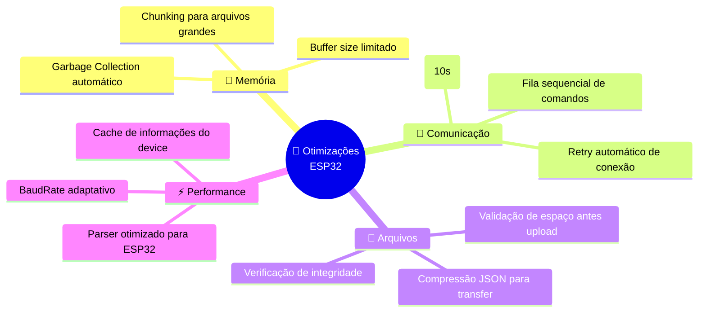

## 🛠️ Comandos e Funcionalidades

### 📋 Lista Completa de Comandos

| Comando | Função | Arquivo | Otimização ESP32 |
|---------|--------|---------|------------------|
| `scanPorts` | Descobrir dispositivos | extension.ts | Filtra portas USB/Serial |
| `connectDevice` | Conectar ESP32 | deviceManager.ts | BaudRate adaptativo |
| `openREPL` | Terminal interativo | replManager.ts | Validação de ambiente |
| `uploadFile` | Enviar arquivo | deviceManager.ts | Modo raw + JSON escape |
| `downloadFile` | Baixar arquivo | deviceManager.ts | Chunks para arquivos grandes |
| `deleteFile` | Remover arquivo | deviceManager.ts | Verificação de espaço |
| `listFiles` | Listar arquivos | deviceManager.ts | Estrutura otimizada |
| `getMemoryInfo` | Info RAM/Flash | deviceManager.ts | gc.collect() automático |
| `resetDevice` | Soft reset | deviceManager.ts | Ctrl+D via fila |

### 🔄 Fluxo de Upload de Arquivo

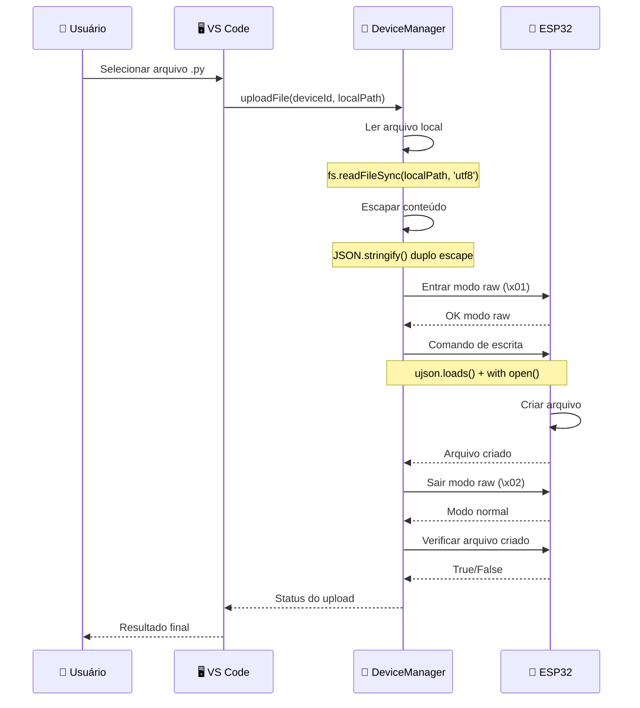

## 🐛 Tratamento de Erros

### ⚠️ Cenários de Erro Comuns

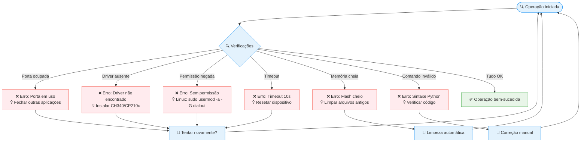

## 📈 Monitoramento e Performance

### 📊 Métricas do Sistema

```mermaid
dashboard
    title 📊 MicroPython Manager - Dashboard
    
    section 🔌 Conexões
        Dispositivos Ativos: 3: [0..10]
        Taxa de Sucesso: 95%: [0..100]
        Tempo Médio Conexão: 2.5s: [0..10]
    
    section 💾 Memória ESP32
        RAM Livre: 180KB: [0..320]
        Flash Usado: 1.2MB: [0..3]
        GC Collections: 45: [0..100]
    
    section ⚡ Performance
        Comandos/min: 12: [0..60]
        Timeout Rate: 2%: [0..10]
        Upload Speed: 8KB/s: [0..20]
    
    section 🐛 Erros
        Conexão: 1: [0..10]
        Upload: 0: [0..10]
        REPL: 1: [0..10]
```

## 🔧 Configurações Avançadas

### ⚙️ Parâmetros de Otimização

```json
{
  "micropython-manager": {
    "serialTimeout": 10000,
    "maxDevices": 10,
    "autoRetryCount": 3,
    "baudRates": [115200, 9600, 57600],
    "chunkSize": 1024,
    "gcThreshold": 0.8,
    "validationTimeout": 15000,
    "replHistorySize": 100
  }
}
```

### 🎛️ Configuração para Diferentes Cenários

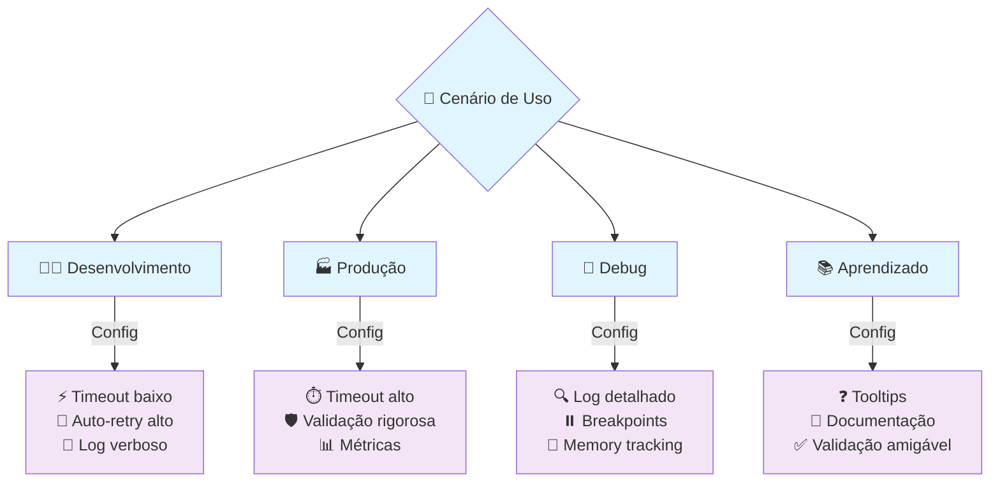

## 🚀 Roadmap de Desenvolvimento

### 📅 Funcionalidades Planejadas

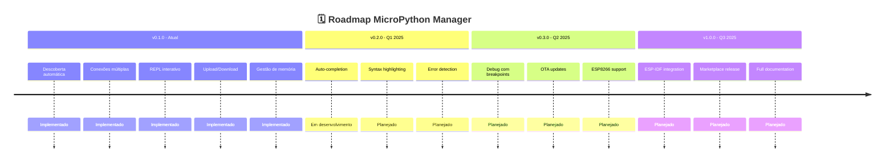

## 📖 Guias de Uso

### 🎯 Para Iniciantes

1. **Conectar ESP32**
   - Conecte via USB
   - Execute "Escanear Portas"
   - Selecione a porta correta

2. **Primeiro código**
   - Abra REPL
   - Digite: `print("Hello ESP32!")`
   - Veja o resultado

3. **Upload de arquivo**
   - Crie arquivo .py
   - Clique com direito no dispositivo
   - Selecione "Upload File"

### 🔧 Para Avançados

1. **Otimização de memória**
   
   ```python
   import gc
   gc.collect()  # Força limpeza
   print(gc.mem_free())  # Verifica RAM livre
   ```

2. **Gestão de arquivos**
   
   ```python
   import os
   os.remove('arquivo_antigo.py')  # Remove
   os.listdir('/')  # Lista todos
   ```

3. **Configuração de hardware**
   
   ```python
   import machine
   machine.freq(240000000)  # CPU 240MHz
   print(machine.unique_id())  # ID único
   ```

---

**Esta documentação é atualizada automaticamente conforme o desenvolvimento do projeto. Para sugestões ou correções, contribua no repositório oficial.**

## 🔗 Links Úteis

- [MicroPython Docs](https://docs.micropython.org/)
- [ESP32 Technical Reference](https://www.espressif.com/sites/default/files/documentation/esp32_technical_reference_manual_en.pdf)
- [VS Code Extension API](https://code.visualstudio.com/api)
- [SerialPort Node.js](https://serialport.io/)

---

📝 **Última atualização:** Dezembro 2024  
👨‍💻 **Versão da documentação:** 1.0.0
