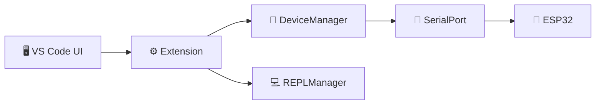

# 📱 MicroPython Manager

**Problema:** Desenvolvedores ESP32 precisam alternar entre múltiplas ferramentas para gerenciar dispositivos, transferir arquivos e debug via REPL, perdendo produtividade.

**Solução:** Extensão integrada ao VS Code que oferece descoberta automática de dispositivos, conexões múltiplas simultâneas, REPL interativo e gestão otimizada de arquivos, tudo otimizado para as limitações de hardware do ESP32.

**Exemplo:** Conecte até 10 ESP32 simultaneamente, faça upload de código Python, monitore memória RAM/Flash em tempo real e execute comandos via REPL integrado.

## ✨ Features Principais

### 🔍 **Descoberta Automática**
- Escaneamento inteligente de portas seriais
- Detecção automática de placas ESP32
- Validação de firmware MicroPython
- Suporte para múltiplos drivers (CH340, CP210x, FTDI)

### 🔌 **Gestão de Múltiplos Dispositivos**
- Conexões simultâneas (até 10 dispositivos)
- Árvore visual com status em tempo real
- Baudrate automático (115200 → 9600 fallback)
- Reconexão automática em caso de falha

### 🖥️ **REPL Interativo**
- Terminal MicroPython integrado
- Validação de ambiente antes da conexão
- Histórico de comandos
- Output colorizado e formatado

### 📁 **Gestão de Arquivos**
- Upload/download otimizado para ESP32
- Verificação de integridade
- Navegação em árvore hierárquica
- Gestão inteligente de espaço em Flash

### 💾 **Monitoramento de Sistema**
- Informações de memória RAM/Flash
- Temperatura do chip ESP32
- Frequência da CPU
- Garbage collection em tempo real

## 🚀 Quick Start

1. **Instale a extensão** no VS Code
2. **Conecte seu ESP32** via USB
3. **Abra Command Palette** (`Ctrl+Shift+P`)
4. **Execute:** `MicroPython: Escanear Portas Seriais`
5. **Selecione** a porta do seu ESP32
6. **Aguarde** a detecção automática do MicroPython
7. **Use** o REPL, faça uploads, monitore memória!

## 📋 Requirements

### Hardware
- Placa ESP32 com firmware MicroPython
- Cabo USB para conexão serial
- Driver apropriado instalado (CH340/CP210x/FTDI)

### Software
- VS Code 1.101.0+
- Node.js (para desenvolvimento)
- Permissões de acesso serial (Linux: dialout group)

### Sistema Operacional
- ✅ Windows 10/11
- ✅ macOS 10.15+
- ✅ Linux (Ubuntu, Debian, Arch, etc.)

## ⚙️ Extension Settings

A extensão funciona out-of-the-box, mas você pode personalizar via `settings.json`:

```json
{
  "micropython-manager.defaultBaudRate": 115200,
  "micropython-manager.connectionTimeout": 10000,
  "micropython-manager.autoReconnect": true,
  "micropython-manager.memoryMonitoring": true
}
```

## 🔧 Comandos Disponíveis

| Comando | Descrição | Atalho |
|---------|-----------|--------|
| `MicroPython: Escanear Portas` | Lista portas seriais disponíveis | - |
| `MicroPython: Conectar Dispositivo` | Conecta a um ESP32 específico | - |
| `MicroPython: Abrir REPL` | Terminal interativo MicroPython | `Ctrl+Shift+R` |
| `MicroPython: Upload Arquivo` | Transfere arquivo para ESP32 | `Ctrl+Shift+U` |
| `MicroPython: Info Memória` | Mostra uso de RAM/Flash | `Ctrl+Shift+M` |
| `MicroPython: Reset Dispositivo` | Soft reset (Ctrl+D) | `Ctrl+Shift+X` |

## ⚠️ Known Issues

### Limitações ESP32
- **RAM limitada**: 320KB disponível para código Python
- **Flash**: ~3MB para arquivos do usuário
- **Comandos simultâneos**: Não suportado via REPL
- **Timeout**: Comandos complexos podem exceder 10s

### Problemas Comuns
- **Porta ocupada**: Feche outros softwares usando a porta serial
- **Permissão negada** (Linux): `sudo usermod -a -G dialout $USER`
- **Driver faltando**: Instale driver CH340 ou CP210x
- **Baudrate incorreto**: Tente 9600 se 115200 falhar

## 📊 Release Notes

### 0.0.1 (Desenvolvimento)
- ✅ Descoberta automática de dispositivos ESP32
- ✅ Conexões múltiplas simultâneas
- ✅ REPL interativo com validação
- ✅ Upload/download de arquivos otimizado
- ✅ Monitoramento de memória em tempo real
- ✅ Interface visual em árvore
- ✅ Gestão inteligente de comandos via fila

### Roadmap
- 🔄 Auto-completion para MicroPython
- 🔄 Debug integrado com breakpoints
- 🔄 OTA (Over-The-Air) updates
- 🔄 Suporte para ESP8266
- 🔄 Integração com ESP-IDF

## 📚 Documentação Técnica

Para informações detalhadas sobre arquitetura, fluxogramas e otimizações:

- **[📖 Documentação Técnica Completa](./DOCUMENTACAO_TECNICA.md)** - Arquitetura, fluxogramas e componentes detalhados
- **[🎨 Diagramas Visuais](./DIAGRAMAS_VISUAIS.md)** - Diagramas de timing, mapas de memória e benchmarks específicos
- **[� Changelog](./CHANGELOG.md)** - Histórico de versões e mudanças

### 🏗️ Arquitetura Resumida



### 🔧 Principais Otimizações ESP32
- **Fila sequencial**: Evita colisões na comunicação serial
- **Chunking inteligente**: Arquivos grandes divididos em 512B
- **Garbage collection**: Monitora RAM automaticamente
- **BaudRate adaptativo**: 115200 → 9600 fallback
- **Recovery automático**: Reconexão em falhas

## 🤝 Contribuindo

## 🤝 Contribuindo

### 🎯 Guidelines de Contribuição

- **Formato Problema + Solução + Exemplo** nos comentários
- **Otimização para ESP32**: Considere limitações de RAM/Flash
- **Teste em hardware real**: Sempre teste com ESP32 físico
- **Documentação**: Atualize docs para novas funcionalidades

### 🔄 Workflow de Desenvolvimento

```bash
# 1. Clone e configure
git clone [repository]
cd micropython-manager
npm install

# 2. Desenvolvimento
npm run watch        # Compilação automática
code .              # Abrir no VS Code
F5                  # Debug da extensão

# 3. Teste
# Conecte ESP32 real e teste todas as funcionalidades

# 4. Build para produção
npm run compile
vsce package        # Gerar .vsix
```

### 🐛 Reportar Issues

Ao reportar problemas, inclua:

- **Modelo do ESP32** (ESP32-DevKit, ESP32-S3, etc.)
- **Versão MicroPython** (`import sys; print(sys.version)`)
- **Sistema Operacional** e versão
- **Logs** do Output Channel da extensão
- **Steps to reproduce** detalhados

## 📄 Licença

MIT License - veja [LICENSE](LICENSE) para detalhes.

## 🎯 Suporte

- 📖 **Documentação**: [docs/](./docs/)
- 🐛 **Issues**: [GitHub Issues](https://github.com/seu-repo/issues)
- 💬 **Discussões**: [GitHub Discussions](https://github.com/seu-repo/discussions)
- 📧 **Email**: micropython-manager@exemplo.com

## 🙏 Agradecimentos

- **Equipe MicroPython** - Por tornar Python possível em microcontroladores
- **Espressif** - Pelos excelentes chips ESP32
- **Comunidade VS Code** - Pela plataforma extensível
- **Comunidade Open Source** - Por libraries como SerialPort.js

---

**Desenvolvido com ❤️ para a comunidade ESP32 & MicroPython**

> 💡 **Dica**: Use `gc.collect()` regularmente em seus scripts ESP32 para liberar memória e evitar fragmentação!
